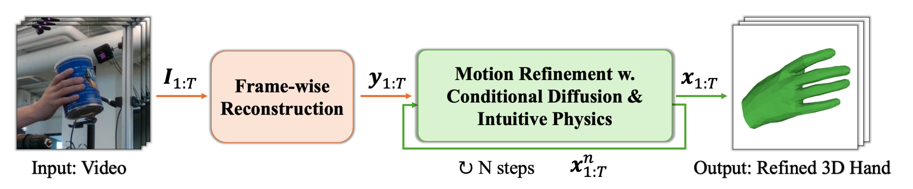

# **<ins>DIP-Hand</ins>: Diffusion-based 3D Hand Motion Recovery with Intuitive Physics** <br />
  [Yufei Zhang](https://zhangy76.github.io/), Zijun Cui, Jeffrey O. Kephart, Qiang Ji <br /> 
  ICCV2025, [arXiv](https://www.arxiv.org/pdf/2508.01835) <br />



This repositoray provides the demo code for recoverying 3D hand motion from a monocular video using DIP-Hand.


## Environment Setup
```bash
conda create -n diphand python=3.9
conda activate diphand
pip install -r requirements.txt
```

## Model and Data Download
Please download the required data and trained model [assets](https://www.dropbox.com/scl/fo/lmtcud0t3pv66msea5mpe/AIjhSD534aW9a3t49lRxnI4?rlkey=kbsny5u9fc3ngdwqcrv9l1619&dl=0) and [example_data](https://www.dropbox.com/scl/fo/cnbmpntkworemifgh2p1p/AD9AfnAJ2VFJ1fqpLQYIUso?rlkey=wj4ei68huu3h9bcs8gjiffb7r&dl=0) and put them in the current directory. 

## Evaluation on a Video
```bash
python demo.py --video_path './example_data'
```

## Citation
If you find our work useful, please kindly give a star and cite the paper!
```bibtex
@InProceedings{Zhang_2025_ICCV,
    author    = {Zhang, Yufei and Cui, Zijun and Kephart, Jeffrey O. and Ji, Qiang},
    title     = {Diffusion-based 3D Hand Motion Recovery with Intuitive Physics},
    booktitle = {Proceedings of the IEEE/CVF International Conference on Computer Vision (ICCV)},
    month     = {October},
    year      = {2025},
    pages     = {7306-7317}
}
```

If you have questions or encouter any issues when running the code, feel free to open an issue or directly contact me via: yufeizhang96@outlook.com

## References
The MANO model data is downloaded from [MANO model](https://mano.is.tue.mpg.de/). The mesh convolution module is adapted from [Mobrecon](https://github.com/SeanChenxy/HandMesh). The mesh data processing module can be installed from [psbody-mesh](https://github.com/MPI-IS/mesh) We thank them for generously sharing their outstanding work.
